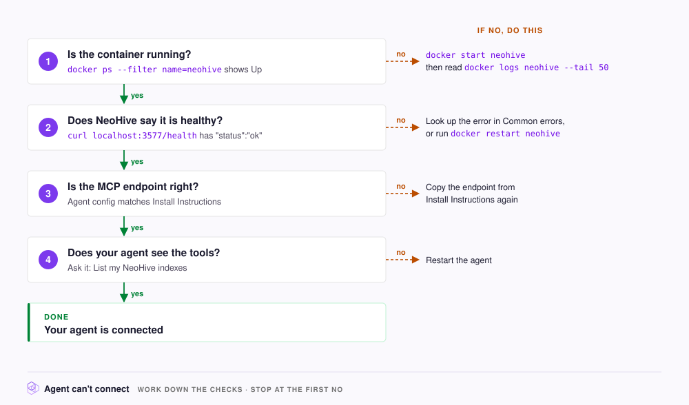

# Agent can't connect

Your agent reaches NeoHive through the [MCP](../concepts/glossary.md#mcp) endpoint of a [Hive](../concepts/glossary.md#hive). When the connection breaks, the agent shows a connection error, or the NeoHive tools do not appear.

Four things must work, in this order: the container, the server, the endpoint, and the agent's tools. The following diagram shows one check for each:

<figure><figcaption></figcaption></figure>

Run the checks in order. Stop at the first check that fails, and apply its fix. The commands use the default address, `localhost:3577`. If NeoHive runs on another machine or port, use that address instead.



## Is the container running?

To check the status of the `neohive` container, run the following command:

```bash
docker ps --filter name=neohive
```

The `neohive` container shows a status of `Up`. A status of `Up` followed by `(unhealthy)` means the container runs but NeoHive reports a problem. In that case, go to the next check. If the container is missing, start it and read the log to see why it stopped:

```bash
docker start neohive
docker logs neohive --tail 50
```

If Docker says `No such container`, the container no longer exists. Run the [installer](../get-started/install.md) again. Your data stays in the `neohive-data` volume.

If the start fails with `port is already allocated`, another program is using port `3577`. Stop that program, or install on another port with `NEOHIVE_PORT=4577`. If you change the port, agents you already connected still use the old one. Open the dashboard on the new port, and use **Install Instructions** to connect each agent again.



## Does NeoHive say it is healthy?

To ask NeoHive for its status, run the following command:

```bash
curl http://localhost:3577/health
```

The following table shows what each reply means:

| Reply contains | Meaning | Fix |
|---|---|---|
| `"status":"ok"` | NeoHive is ready. | Go to the next check. |
| `"status":"error"` | NeoHive has a problem that stops it from working. The `error` text in the reply names it. | Look up the `error` text in [Common errors](common-errors.md#server-and-dashboard). |
| `"status":"degraded"` | At least one Hive failed its check. | Restart NeoHive with `docker restart neohive`, and then run this check again. |

If `curl` reports `Failed to connect`, the container is not running. Go back to the first check.



## Is the MCP endpoint right?

Each Hive has its own endpoint, ending in `/hives/<hive-id>/mcp`. To check the endpoint, do the following:

1. Open the Hive in the dashboard.
2. Copy the endpoint from **Install Instructions**.
3. Compare the endpoint with your agent's MCP configuration, character by character. In Claude Code, `claude mcp get <name>` prints the URL. `<name>` is the server name that follows `claude mcp add` in the **Install Instructions** command.

A wrong Hive ID returns `Unknown Hive: <id>`. A wrong port or host returns a connection error. After your agent reaches the Hive, **Install Instructions** shows a `CONNECTED` count.



## Does your agent see the tools?

Ask your agent:

```text
List my NeoHive Indexes.
```

Your agent calls `list_indexes` and answers. If the agent does not have the `list_indexes` tool, the agent has not loaded the NeoHive MCP server. Restart the agent after any configuration change.

In Claude Code, start Claude Code in the folder where you ran the **Install Instructions** command, because the server is saved in that folder's `.mcp.json`. For other agents, see [Connect your agent](../get-started/connect/README.md).



## Still stuck?

To get help, do the following:

1. To collect a diagnostics bundle, run the following command:

   ```bash
   curl -fsSL https://raw.githubusercontent.com/NeoHiveAI/install/main/logs.sh | bash
   ```

2. Send the bundle to `hello@neohive.ai` with a description of what fails.

The bundle holds logs and settings with secrets removed. The bundle does not include your [Memories](../concepts/glossary.md#memory), code, or databases.
