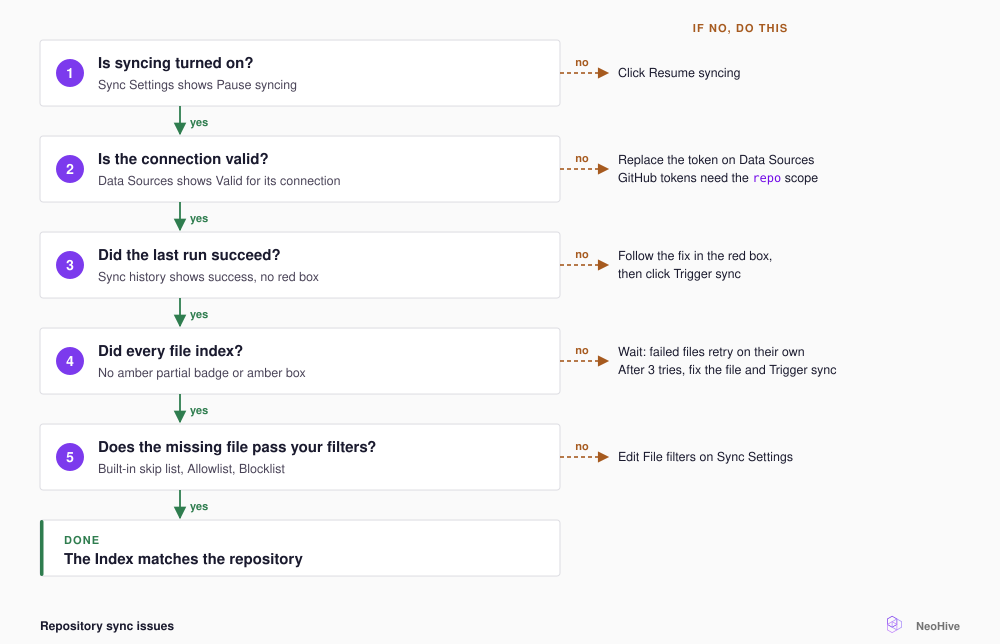

# Repository sync issues

Use this page to find out why a Code or Documentation [Index](../concepts/glossary.md#index) is out of date, and to get it syncing again.

<figure><figcaption></figcaption></figure>

Open the Index in the dashboard. **Sync history** lists every run with its status and error. When a sync has a problem, a red or amber box appears at the top of the page.

## What the Index page shows

| You see | Cause | Fix |
|---|---|---|
| **Resume syncing** on **Sync Settings** | Syncing is paused, so no scheduled sync runs. | Select **Resume syncing**. |
| `This Index's connection was removed.` | Someone deleted the Index's connection from **Data Sources**. | Select **Assign connection**. If you have no connections, select **Add a data source**. |
| Red box: **Branch not found on the remote** | Someone renamed or deleted the branch, and NeoHive could not choose its replacement. | Under **Sync a different branch**, select a branch, and then select **Sync this branch**. If that fails, select **Force reset to origin**. |
| Red box: **The branch is no longer on the remote** | Someone renamed or deleted the branch. | On the **Sync Settings** tab, select an existing branch in **Branch**. Select **Save settings**, and then select **Trigger sync**. |
| Red box: **A git command failed** | The repository URL is wrong, or the connection cannot read the repository. | Check the connection on **Data Sources**, and then select **Trigger sync**. |
| Red box: **The sync failed** | Something else failed. The box shows the error message. | Look up the message in [Common errors](common-errors.md). |
| Red box: **Embedding dimension mismatch. Sorry about this!** | NeoHive built the Index with the wrong embedding dimensions, and you cannot repair the Index. | Follow the steps in the box. Delete the Index under **Danger Zone** on **Index Info**, and then add the Index again with **Add Index**. |
| Amber `partial` badge, or `... files failed to index and will be reindexed automatically.` | Some files failed to index, often while the embedding engine restarted. | Wait for the automatic retry. NeoHive retries those files after two minutes. |
| Amber box: `... could not be indexed after 3 attempts. Trigger a sync to retry.` | The same files failed three syncs in a row. | Read the file error in **Sync history**. Fix the file or filter it out, and then select **Trigger sync**. |
| `A sync is already running for this Index` | You selected **Trigger sync** while a sync was running. | No fix is needed. Wait for the running sync to finish. |

NeoHive usually handles a renamed default branch, such as `master` to `main`, for you. NeoHive switches the Index to the new branch and continues syncing.

## Connections

To check a connection, open **Data Sources** and select **Manage** on the service. Each connection shows **Valid**, **Invalid**, or **Unvalidated**. If a token no longer works, each sync that uses the token fails with **A git command failed**. You cannot edit a token. Instead, add a new connection with a working token, and assign the new connection to the Index. For the steps, see [Credentials and secrets](../security/credentials.md).

## Slow or stalled syncs

The first sync clones the repository and indexes every file, so a large repository takes longer. The Index page shows the sync's progress. Later syncs index only the files that changed. If you change the **File filters**, the next sync re-reads every file. If progress stops, read the log:

```bash
docker logs neohive --tail 50
```

## Schedule

Each Index syncs on the **Sync interval** set on its **Sync Settings** tab. The interval ranges from **Every 15 minutes** to **Daily**. A repository added from the dashboard starts at **Every 4 hours**. To sync now, select **Trigger sync**, or call the [webhook refresh endpoint](../reference/webhooks.md) from your continuous integration (CI) system.

## Files that never appear

A file must pass the built-in skip list, your **Allowlist**, and your **Blocklist**. NeoHive always skips PDFs in a repository. To see how the three checks combine, read [File pattern syntax](../reference/file-patterns.md).

## Still stuck?

To get help, do the following:

1. Run the following command to collect a diagnostics bundle:

   ```bash
   curl -fsSL https://raw.githubusercontent.com/NeoHiveAI/install/main/logs.sh | bash
   ```

2. Send the bundle to `hello@neohive.ai` with the name of the repository that fails.

## Next step

For any other message, see [Common errors](common-errors.md).
